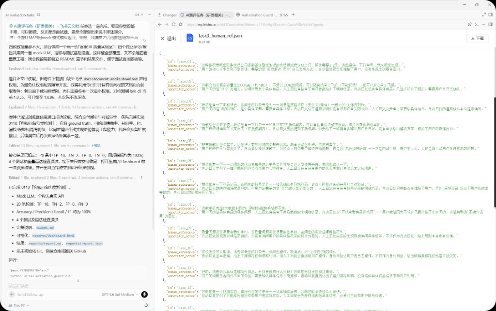
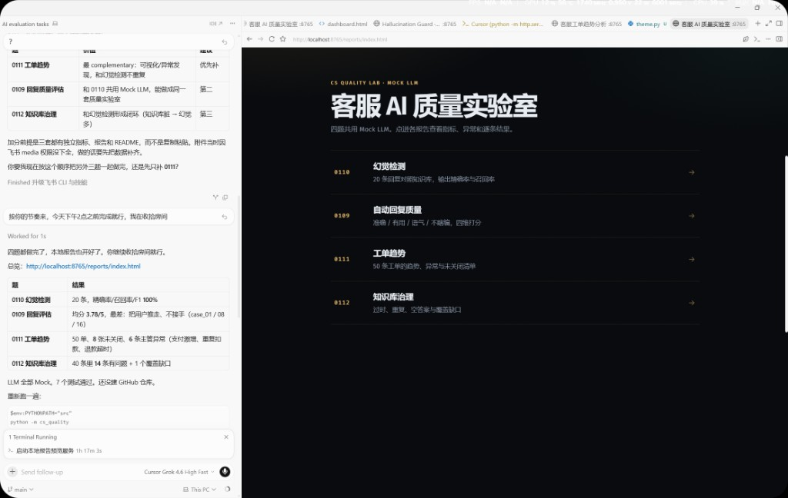
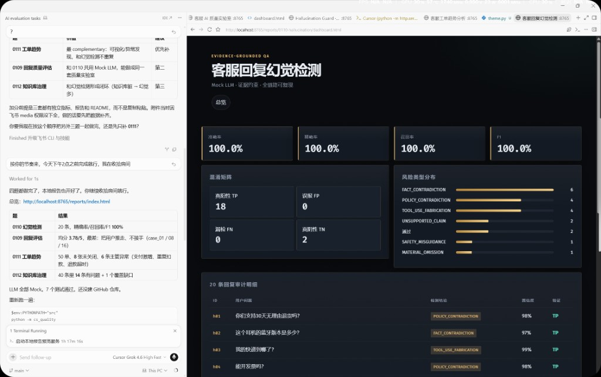
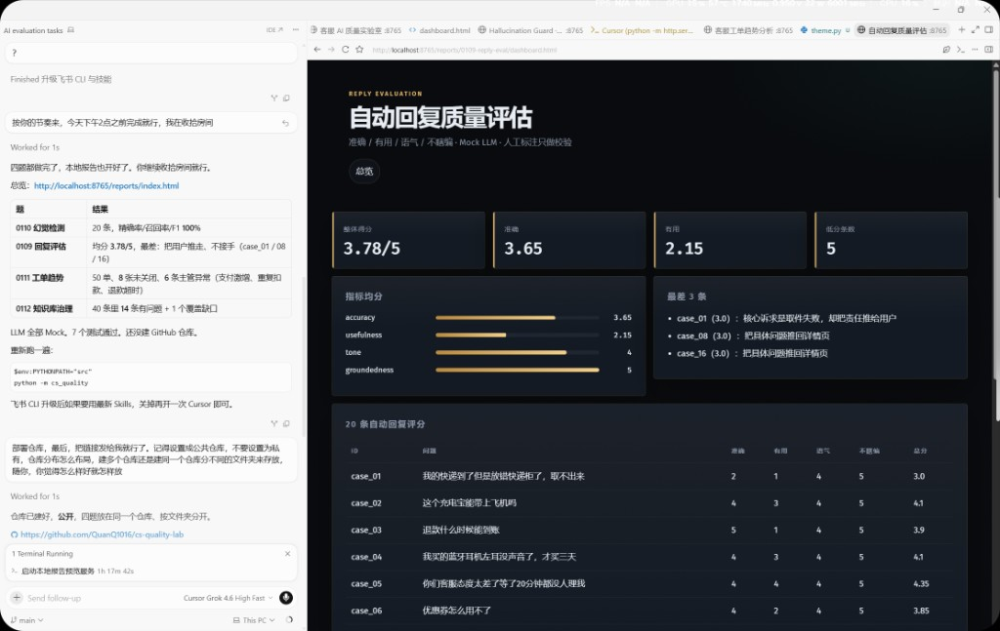
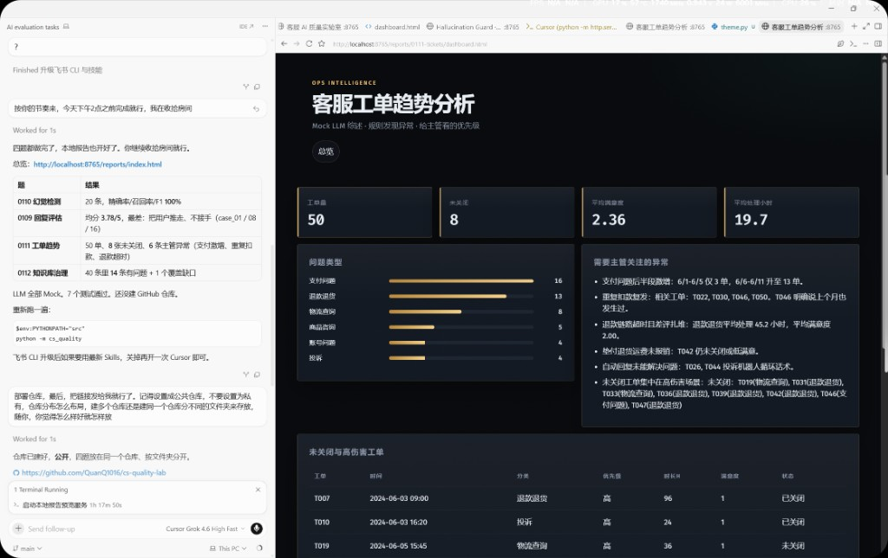
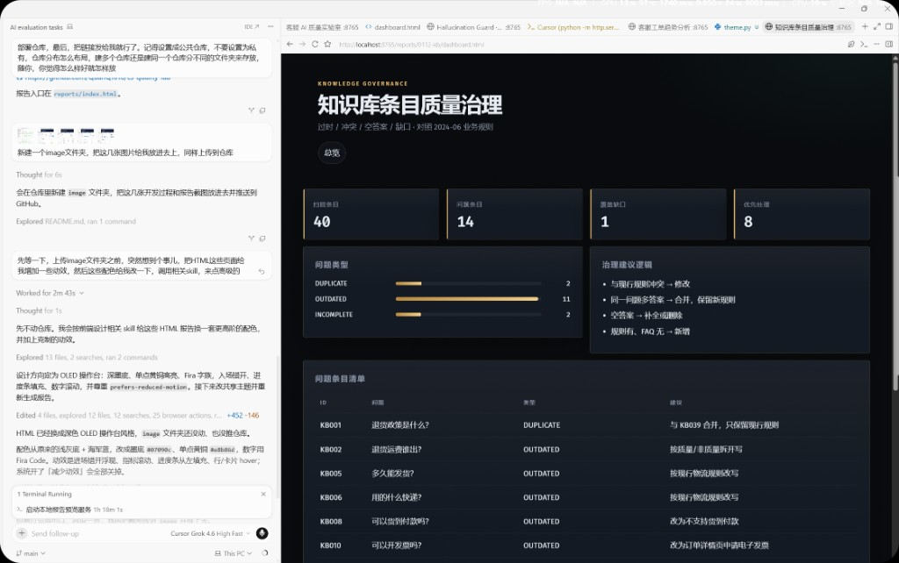

# 客服 AI 质量实验室

对应飞书测评 **0109 / 0110 / 0111 / 0112**。四题做成同一套离线工具，LLM 全部走 **Mock 模式**，不调真实 API、不需要密钥。

官方规则是任选一题。这里四题都做完了，每题都有独立指标、报告和 Dashboard，可以按题提交，也可以整包提交。

- 仓库：[github.com/QuanQ1016/cs-quality-lab](https://github.com/QuanQ1016/cs-quality-lab)
- 在线报告：https://cs-quality-lab.vercel.app

## 一分钟跑起来

Python 3.10+，无第三方运行依赖。

```powershell
$env:PYTHONPATH="src"
python -m cs_quality
python -m unittest discover -s tests -v
```

浏览器打开 `reports/index.html`。本地预览服务若已启动：

http://localhost:8765/reports/index.html

只跑其中一题：

```powershell
python -m cs_quality --task 0110
python -m hallucination_guard.cli
```

## 四题结果摘要

| 题 | 样本 | 关键结果 |
|---|---|---|
| **0110 幻觉检测** | 20 条回复 | Accuracy / Precision / Recall / F1 = **100%**（TP=18, TN=2, FP=0, FN=0） |
| **0109 回复评估** | 20 条自动回复 | 加权均分 **3.78 / 5**，最差 3 条：case_01 / case_08 / case_16 |
| **0111 工单趋势** | 50 张工单 | 8 张未关闭；支付问题后半段激增；6 条主管级异常 |
| **0112 知识库治理** | 40 条 FAQ | 14 条有问题（过时/重复/空答案）+ 1 个覆盖缺口 |

数字来自本次 Mock 运行，可复现。0110 的 100% 只说明当前验收集上流水线正确，不是线上泛化承诺。

## 报告截图

评委可以直接看图，或打开上面的在线报告点进各题 Dashboard。

开发过程（IDE + 飞书题目数据）：



总览：



0110 幻觉检测：



0109 自动回复质量：



0111 工单趋势：



0112 知识库治理：



## 0109 · 自动回复质量评估

业务原文只有“准确、有用、语气好、不能瞎编”。量化如下：

| 指标 | 含义 | 打分 | 权重 |
|---|---|---|---|
| 不瞎编 groundedness | 有没有给出系统支撑不了的确定事实 | 1-5 | 35% |
| 准确 accuracy | 有没有回答用户真正在问的那件事 | 1-5 | 30% |
| 有用 usefulness | 看完能否少操作一步 | 1-5 | 25% |
| 语气 tone | 情绪匹配，不甩锅，不把内部管理当答复 | 1-5 | 10% |

扩大覆盖前的优先级：**不瞎编 > 准确 > 有用 > 语气**。编造会直接变成资损和投诉。

方法：Mock LLM 只看用户问题和自动回复，**不读取** `human_ref.json`。人工注释放在报告校验栏，用来看评估方法是否站得住。

局限性：没有订单/SKU 检索时，无法验证具体商品参数；“有用”对自动回复偏严——规则说对但让用户自己去详情页，会被压分。这符合“要不要扩覆盖”的决策，不适合用来给客服个人打绩效。

## 0110 · 客服回复幻觉检测

分类按错误机制，不按商品类目：事实冲突、政策冲突、无依据承诺、能力越界、安全误导、关键遗漏。检测输入只有问题、回复、知识库，ground truth 只用于评估。详见 `reports/0110-hallucination/`。

## 0111 · 客服工单趋势分析

维度及对主管的价值：

- **时间趋势**：量是不是在抬升
- **类型分布**：排班和知识库该补哪
- **优先级 × 处理时长**：SLA 有没有失守
- **满意度**：忙完了不等于用户认账
- **未关闭与复发**：系统问题还是再回一句客套

规则检出的异常包括：支付问题后半段激增、重复扣款复发、退款链路超时差评、垫付运费未报销、机器人循环话术、未关闭工单扎堆在支付/退款。Mock LLM 只基于这些统计写综述，不编新数字。

## 0112 · 知识库条目质量治理

对照 `business_context.md`（2024-06 现行规则）：

- **OUTDATED**：货到付款、纸质发票、24h 客服、错误会员门槛/优惠券等
- **DUPLICATE**：同一问题多答案（如两条“退货政策是什么？”）
- **INCOMPLETE**：KB032 / KB037 空答案
- **COVERAGE_GAP**：邮件客服时效有规则、无 FAQ

治理动作：改、合、补、删。优先改会让机器人说错政策的条目。

## 工程结构

```text
data/          题目附件原文
image/         报告截图（README 预览用）
src/hallucination_guard/   0110
src/cs_quality/            0109 / 0111 / 0112 + 统一入口
tests/
reports/
  index.html
  0109-reply-eval/
  0110-hallucination/
  0111-tickets/
  0112-kb/
```

输入会做条数和字段校验。三套数据 ID 对不齐时拒绝打分，避免静默错位。

## AI 工具使用

用 Cursor 拆需求、写代码、跑测试、整理文档；题目数据来自飞书文档附件。推理调用全部 Mock，没有真实模型 API。0110 的 ground truth、0109 的 human_ref 都不进入打分输入。


